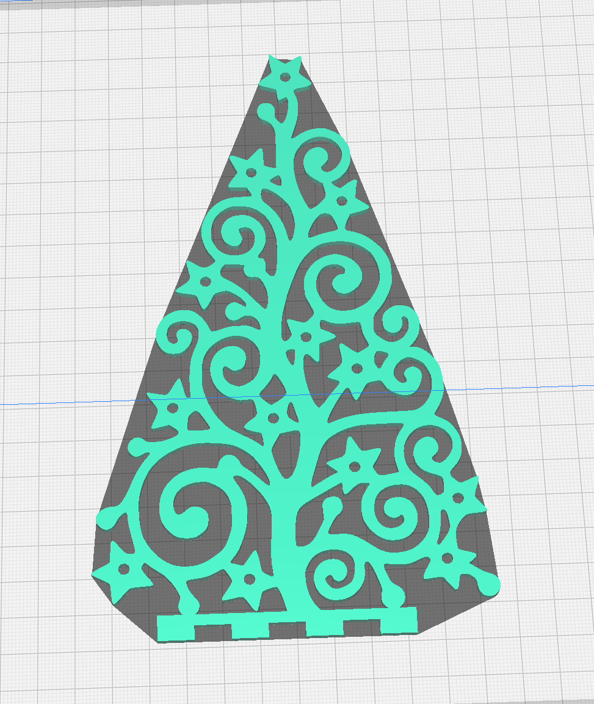
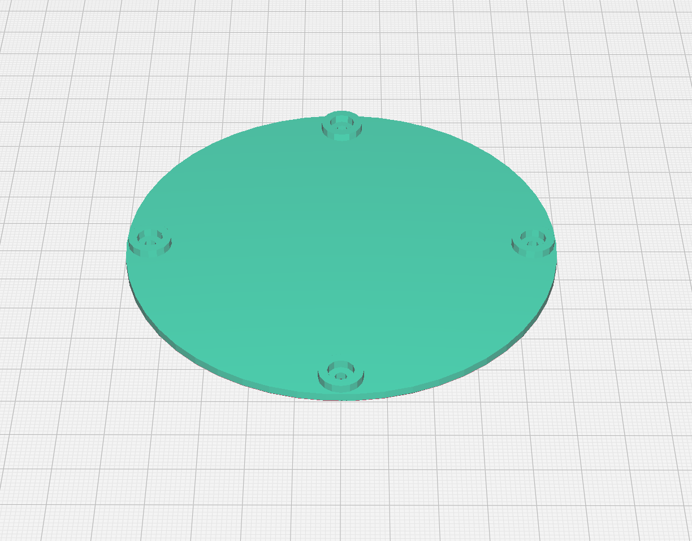
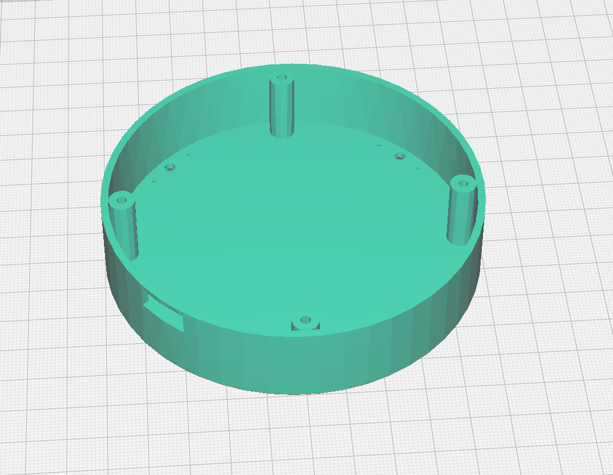
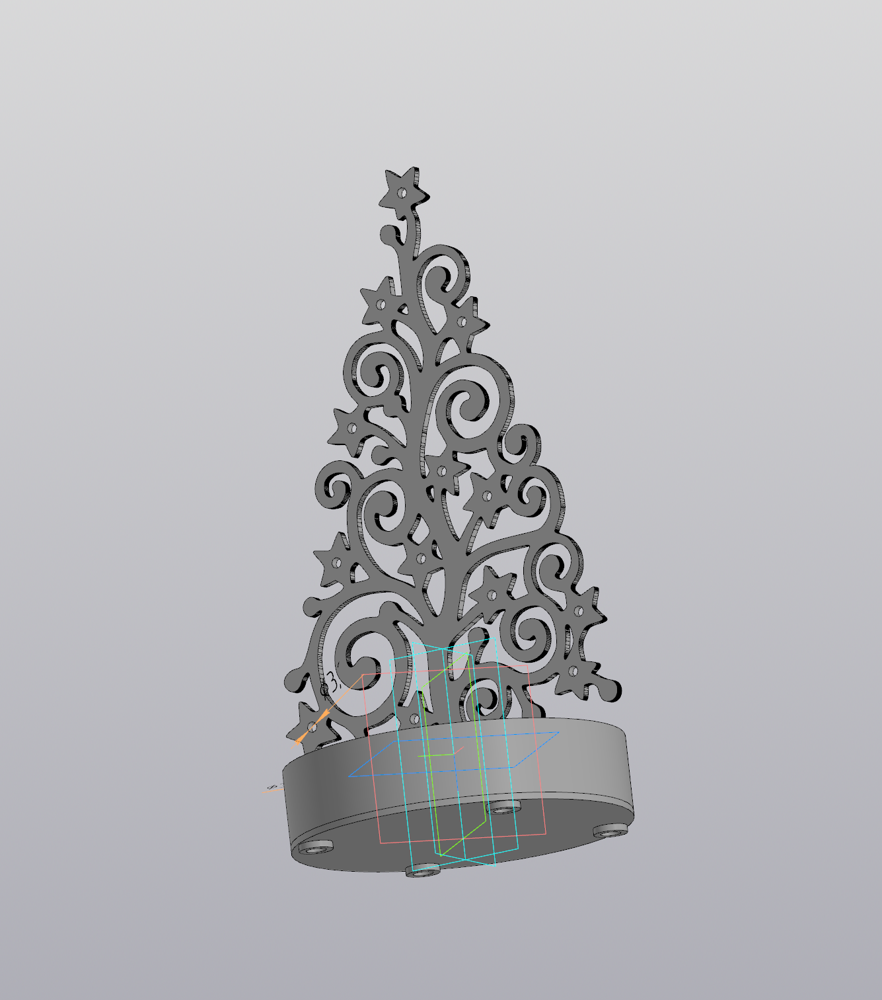

# Christmas-tree with illumination
# Новогодняя елка мини с подсветкой

Сделанное из того что было, небольшое новогоднее украшение :)

Что необходимо:
1. Корпус печатается на 3Д принтере, подставка, крышка - PETG, сама Елка - PLA Glow (светящийся в темноте)
2. Светодиоды 3 вольта диаметром 3мм (Можно любой размер, при условии редактирования отверстий)
3. Немного проводов.
4. Разъем USB Type-C  - что бы удобно было подключать к современной зарядке - по желанию.
5. Любой подходящий микроконтроллер (я использовал ESP8266 NodeMCU v3)
 

